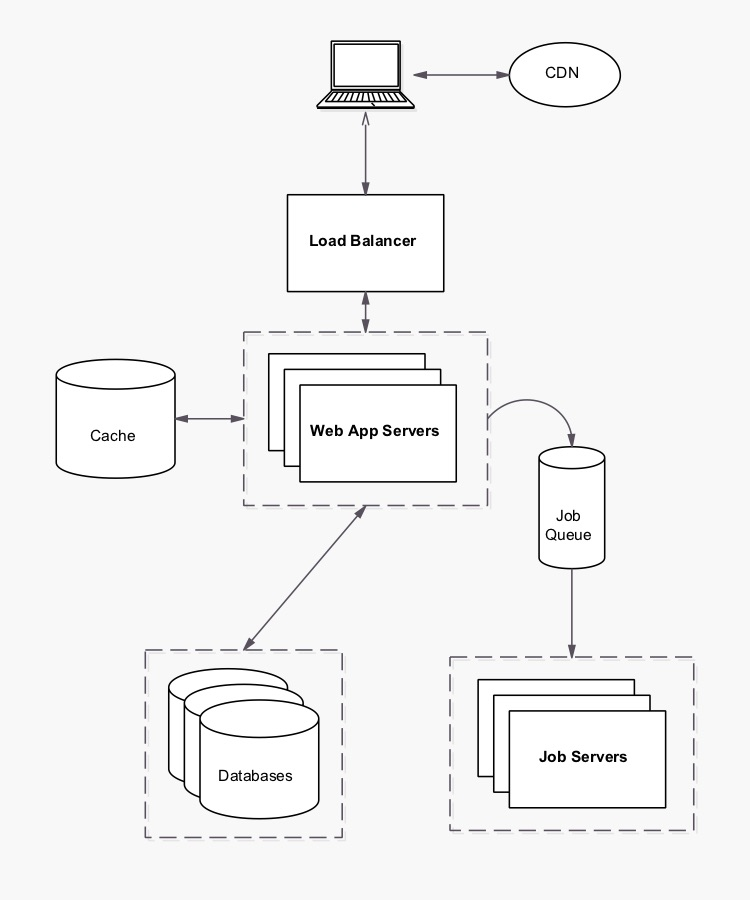

# Summary

This proposal outlines the steps to optimize and scale web application.

# Proposal

### Caching
- Storing copies of frequently accessed data in a Memcached / Redis.
- Leverage browser caching.
- Pregenerating of uid.

### Load balancing
- Distribute the load over multiple servers and limit failure for the load thats coming in from users.

### Optimization

##### PHP
- Use opcache for storing precompiled bytecode in shared memory.
- Store sessions in redis.

##### Nginx
- Use TLS.
- Use HTTP/2.
- Client-side Caching.

##### MySQL
- Partitioning of data to decomposing tables row-wise.
- Replication of data to offload work from by providing more nodes.

## Application Architecture

